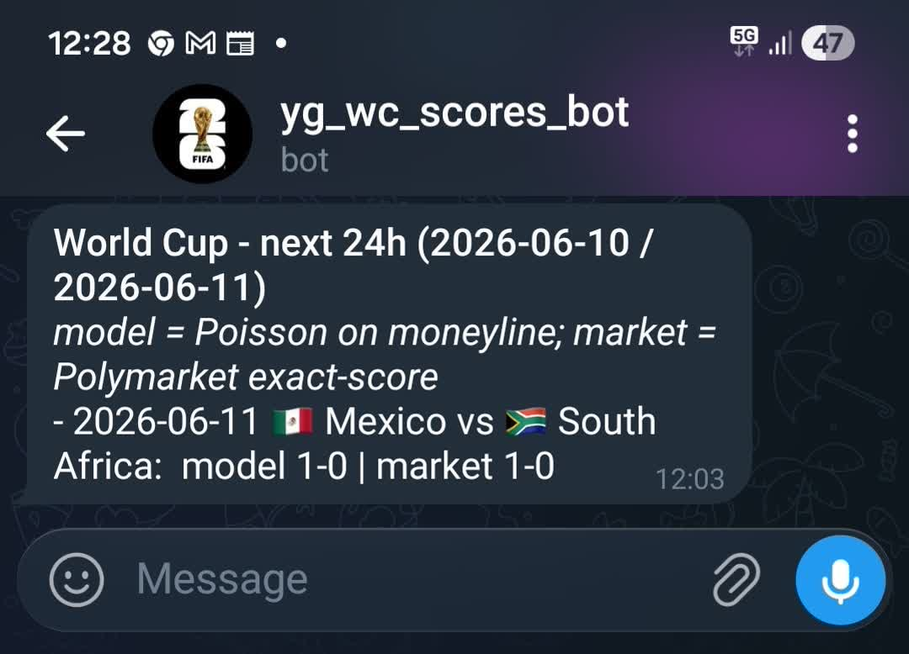
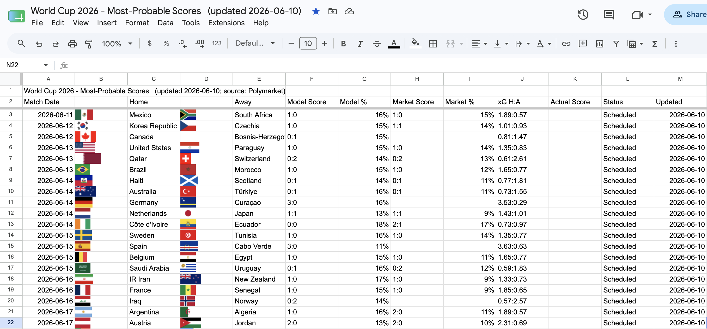

<div align="center">
  
  <br><br>

  
  
  
  
  

  <br>
  <strong>Every day at noon: the most probable scoreline for every World Cup game, straight to your Telegram.</strong>
</div>

---

## What you get

**A Telegram message every day at noon** with today's and tomorrow's games:

<div align="center">
  
</div>

**A Google Sheet with all 72 games**, updated daily with predictions and actual results as they come in:

<div align="center">
  
</div>

Plus a second tab with **World Cup winner and Golden Boot odds** from the markets.

---

## How it works

```
Polymarket API  →  daily_scores.py  →  Telegram  (today + tomorrow)
 (no key needed)                    →  Google Sheet  (all 72 games)
```

Predictions come from [Polymarket](https://polymarket.com) — the world's largest prediction market — processed through a statistical model:

1. Fetches live odds (no API key needed)
2. Removes the bookmaker margin (de-vigging)
3. If the exact-score market is liquid and consistent: uses it directly
4. Otherwise: fits an independent Poisson model to the moneyline and picks the most probable score
5. Caches predictions so finished games keep their pre-game pick

---

## What you need

- A **Mac** (uses macOS scheduling)
- A **Telegram** account (free, any phone)
- A personal **Google** account for the Sheet
- The **Terminal** app (every Mac has it: Applications → Utilities)

No packages to install — the script uses only built-in Python libraries.

---

## Setup

### 1 - Download the code

Open Terminal and run:

```bash
git clone https://github.com/YG15/wc-score-bot.git
mkdir -p ~/wc-scores
cp wc-score-bot/daily_scores.py wc-score-bot/com.wcscores.plist ~/wc-scores/
```

### 2 - Create a Telegram bot

1. Open Telegram, search for **@BotFather**, start a chat
2. Send `/newbot`
3. Choose any name (e.g. `WC Scores`) and a username ending in `bot` (e.g. `mywcscores_bot`)
4. BotFather replies with a **token** like `1234567890:ABCDEFGxxx` — save it

> Tip: you can also set a profile photo for your bot via BotFather — send `/setuserpic` after creating it.

### 3 - Find your Telegram chat ID

1. Search for your bot and press **Start**, then send it any message
2. Open this URL in a browser (replace `YOUR_TOKEN`):
   ```
   https://api.telegram.org/botYOUR_TOKEN/getUpdates
   ```
3. Find the number after `"chat":{"id":` — that is your chat ID

### 4 - Save your credentials

```bash
echo "YOUR_TOKEN" > ~/wc-scores/telegram.txt
echo "YOUR_CHAT_ID" >> ~/wc-scores/telegram.txt
chmod 600 ~/wc-scores/telegram.txt
```

### 5 - Set up the Google Sheet

**Create a blank sheet:**
1. Make sure you're logged into your **personal** Google account
2. Go to [sheets.new](https://sheets.new)

**Add the script:**
1. Click **Extensions → Apps Script**
2. Delete everything in the editor
3. Copy-paste the full contents of `apps_script.js` from this repo
4. Save with Cmd+S

**Deploy it:**
1. Click **Deploy → New deployment**
2. Gear icon → **Web app**
3. "Who has access" → **Anyone** → **Deploy**
4. Approve any permission prompts
5. Copy the **Web app URL** (looks like `https://script.google.com/macros/s/.../exec`)

```bash
echo "YOUR_WEB_APP_URL" > ~/wc-scores/sheet_webhook.txt
chmod 600 ~/wc-scores/sheet_webhook.txt
```

### 6 - Schedule the daily job

```bash
sed "s/YOUR_USERNAME/$(whoami)/g" ~/wc-scores/com.wcscores.plist \
  > ~/Library/LaunchAgents/com.wcscores.plist

launchctl load -w ~/Library/LaunchAgents/com.wcscores.plist
```

Confirm it loaded:
```bash
launchctl list | grep wcscores
```

### 7 - Test it

```bash
# Dry run - prints output, sends nothing:
/usr/bin/python3 ~/wc-scores/daily_scores.py --print

# Real run - posts to Telegram and updates the Sheet:
/usr/bin/python3 ~/wc-scores/daily_scores.py
```

Check your Telegram. The Sheet will appear in your Google Drive recents as **"World Cup 2026 - Most-Probable Scores"**.

---

## Quick reference

| Task | Command |
|------|---------|
| Run now (skip the wait) | `launchctl kickstart -k gui/$(id -u)/com.wcscores` |
| View logs | `tail -50 ~/wc-scores/launchd.log` |
| Stop permanently | `launchctl unload ~/Library/LaunchAgents/com.wcscores.plist` |

**Change the run time** (e.g. 9am instead of noon): open `~/Library/LaunchAgents/com.wcscores.plist` in any text editor, change the `12` under `Hour` to `9`, then reload:

```bash
launchctl unload ~/Library/LaunchAgents/com.wcscores.plist
launchctl load -w ~/Library/LaunchAgents/com.wcscores.plist
```

---

## Notes

- The bot **auto-stops after 20 July 2026** (day after the final). No action needed.
- Your Mac must be **awake at noon** for the scheduled job to fire. If it was sleeping, run it manually.
- An internet connection is required each run.

---

## Files

| File | What it is |
|------|-----------|
| `daily_scores.py` | The main script. Stdlib-only, no installs needed. |
| `apps_script.js` | Paste this into your Google Sheet's Apps Script editor. |
| `com.wcscores.plist` | macOS scheduler template (fires at noon daily). |
| `telegram.txt.example` | Format reference — create your own `telegram.txt` with real values. |
| `sheet_webhook.txt.example` | Format reference for the webhook URL. |

---

<details>
<summary><b>Troubleshooting</b></summary>

<br>

**No Telegram message received**
- Check logs: `tail -20 ~/wc-scores/launchd.log`
- Confirm `telegram.txt` has exactly two lines: token on line 1, chat ID on line 2
- You must send the bot a message first before it can message you

**Sheet is not updating**
- Confirm `sheet_webhook.txt` has the exact URL from the Apps Script deployment
- The Apps Script must be bound to the Sheet (created via Extensions → Apps Script inside the Sheet, not as a standalone script)

**`command not found: git`**
- Run `xcode-select --install` in Terminal to get Git

**launchctl load fails / `YOUR_USERNAME` not replaced**
- Check: `cat ~/Library/LaunchAgents/com.wcscores.plist` — should show your actual Mac username, not `YOUR_USERNAME`
- Re-run the `sed` command from Step 6

</details>
